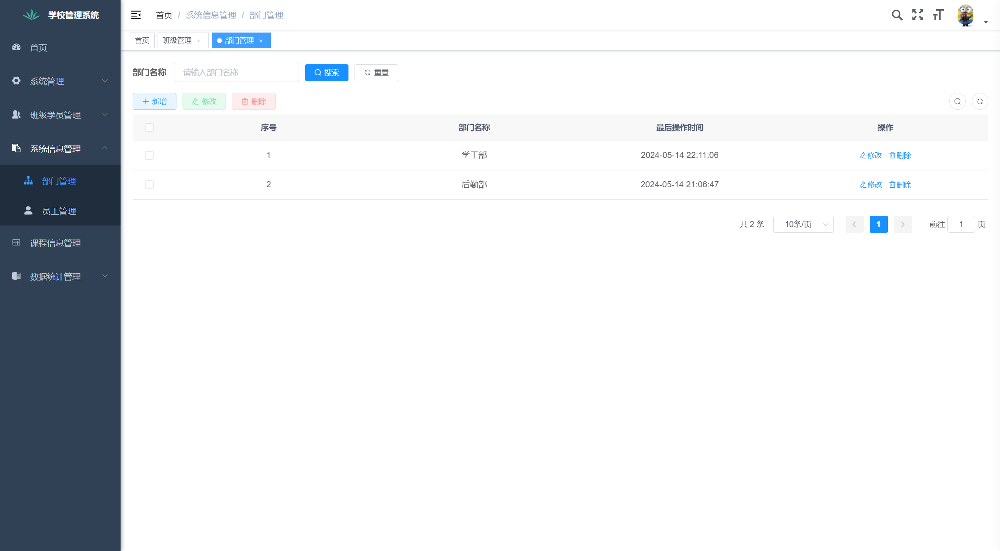
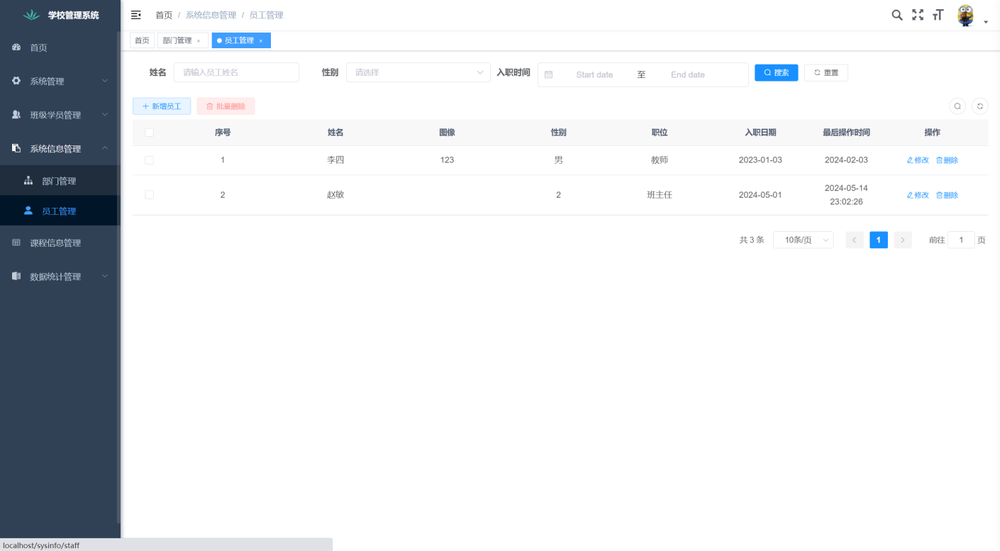
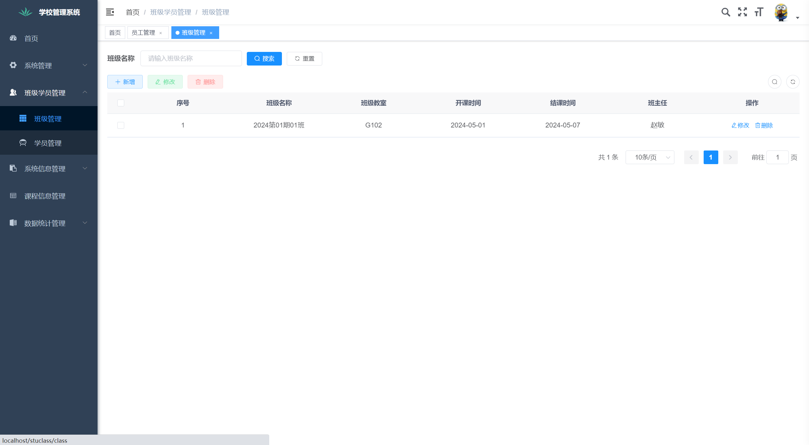
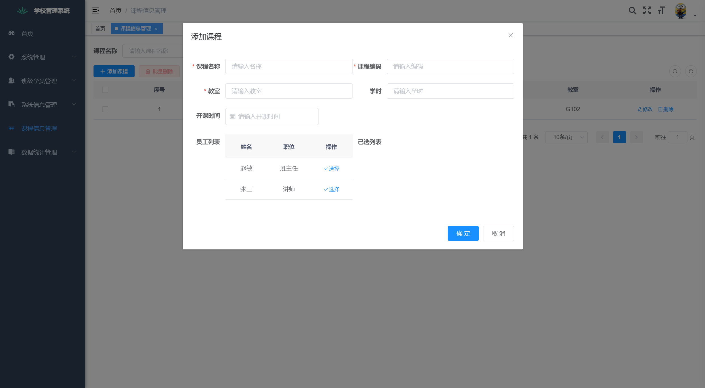

# 学校管理系统 (基于若依框架)
## 前端：Vue3, javascript, elementplus
## 后端：Spring Boot、Spring Security、Redis & Jwt
## 界面展示
### 登陆界面
<figure>
  
</figure>

### 部门列表
<figure>
  
</figure>

### 教师列表
<figure>
  
</figure>

### 班级列表
<figure>
  
</figure>

### 课程管理
<figure>
  
</figure>

